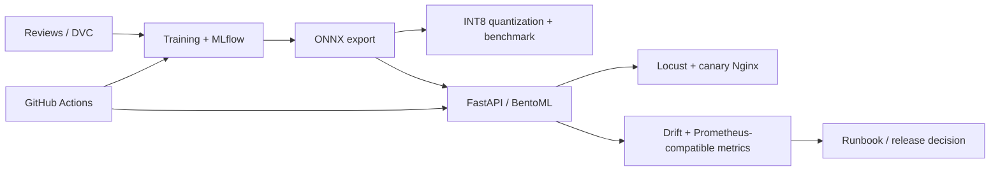

# Arabic Sentiment Analysis MLOps

An end-to-end Deep Learning MLOps project for Arabic sentiment classification. It packages an AraBERT-compatible predictor behind FastAPI, adds MLflow/DVC experiment and data lineage, BentoML adaptive batching, ONNX INT8 tooling, drift calculations, Prometheus-compatible rendering, CI quality gates, and an operational runbook.

## Three-command quick start

These are the three commands a reviewer can run on a clean machine to install the repository and obtain an API prediction without downloading a model or starting a background service:

```bash
git clone https://github.com/Nour226/Arabic-sentiment-analysis.git && cd Arabic-sentiment-analysis
python -m pip install -e ".[dev,serving,loadtest,optimization]"
python -c "from fastapi.testclient import TestClient; from arabic_sentiment.api.main import app; print(TestClient(app).post('/predict', json={'text':'هذا المنتج ممتاز'}).json())"
```

The third command exercises the same `/predict` contract used by the service. It uses the explicit development fallback when `models/model.onnx` is absent; production-model evidence is listed in the readiness report. Python 3.10+ is required. Docker Desktop with Compose v2 is additionally required for MLflow, MinIO, the API container, and the canary stack.

## API contract

Start the service with:

```cmd
uvicorn arabic_sentiment.api.main:app --host 127.0.0.1 --port 8000
```

Then call it from another terminal:

```bash
curl -X POST http://localhost:8000/predict -H "Content-Type: application/json" -d "{\"text\":\"هذا المنتج ممتاز وسريع التوصيل\"}"
```

The response contains `label`, `confidence`, `probabilities`, and `model_version`. `/health` is used by the Docker healthcheck; `/metadata` exposes model identity; `/predict/batch` scores a small list. Empty text returns HTTP 422 and every response carries `X-Request-ID`.

## Architecture



## Repository layout

```text
src/arabic_sentiment/   installable package, predictor, API, training, batch scoring
serving/                BentoML adaptive-batching service
loadtest/               Locust workload
optimization/           ONNX quantization and benchmark harness
monitoring/             PSI/KS drift helpers and metrics text exporter
pipelines/              DVC stages and parameters
docker/                 API, MLflow/MinIO, and Nginx Compose configuration
reports/                one report per module plus final readiness evidence
docs/                   3am operational runbook
tests/                  deterministic unit and integration tests
```

## Module releases and session changelog

| Release | Module | Main deliverable | Verification |
|---|---|---|---|
| `v0.1.0` | Packaging/API | Installable package, FastAPI contract, Docker baseline | API tests and healthcheck |
| `v0.2.0` | Tracking/versioning | MLflow/MinIO Compose, DVC stage, CI gate | Ruff, pytest, DVC and Compose checks |
| `v0.3.0` | Serving | BentoML batching, Parquet scoring, Locust, 5% Nginx canary | 1,000-row scoring and load run |
| `v0.4.0` | Optimization | ONNX dynamic INT8 utility and benchmark harness | Tiny-ONNX integration test |
| `v0.5.0` | Observability | PSI/KS detector, Prometheus text exporter, runbook | Monitoring unit tests and full suite |

Each module was delivered from its own branch, reviewed through a pull request, merged to `main`, and tagged. The exact evidence and limitations are in [`reports/final-readiness.md`](reports/final-readiness.md).

## Install and quality checks

On Windows, activate the existing environment with `venv\\Scripts\\activate`, then install the needed extras:

```cmd
python -m pip install -e ".[dev,ml,data,serving,loadtest,optimization,monitoring]"
ruff check src tests serving loadtest optimization monitoring
pytest -v --cov=src/arabic_sentiment --cov-fail-under=80
```

GitHub Actions runs lint, test/coverage, DVC graph, Compose validation, and the API image-build checks on pull requests and pushes. The workflow does not publish a Docker Hub image because no registry credentials are stored in this repository; configure repository secrets before claiming registry publication.

## Dataset, DVC, and training

Fetch the Kaggle source and generate the deterministic sample:

```cmd
python scripts/download_data.py
```

The sample pointer is [`data/raw/reviews_sample.csv.dvc`](data/raw/reviews_sample.csv.dvc); the CSV and model binaries are intentionally ignored by Git. Configure a DVC remote before using `dvc pull` on another machine.

Start tracking services and train:

```cmd
docker compose -f docker/docker-compose.yml up -d
python -m arabic_sentiment.train --data data/raw/reviews_sample.csv
dvc repro pipelines/dvc.yaml:train
```

MLflow is at http://localhost:5000 and MinIO is at http://localhost:9001. The default local MinIO credentials are `minioadmin` / `minioadmin123`; override them through environment variables for shared use. Training requires the `ml` and `data` extras and a downloaded dataset.

## Serving, batch scoring, and load testing

```cmd
venv\Scripts\bentoml.exe serve serving.service:ArabicSentimentService --host 127.0.0.1 --port 3000
python -m arabic_sentiment.batch --data data/raw/reviews_sample.csv --max-rows 1000 --output artifacts/batch/predictions.parquet
locust -f loadtest/locustfile.py --headless -u 10 -r 2 --run-time 30s --host http://localhost:8000
```

The recorded fallback FastAPI run was 428 requests, zero failures, 51.97 ms mean latency, and 14.91 requests/sec. It is explicitly a fallback benchmark, not trained-model or production-capacity evidence. The optional canary stack uses `docker compose -f docker/docker-compose.yml --profile canary up -d nginx api_canary api` and Nginx routes 5% to the canary.

## Optimization

After a completed training/export run, quantize and benchmark:

```cmd
python optimization/quantize_onnx.py --input models/model.onnx --output models/model_int8.onnx
python optimization/benchmark.py --fp32 models/model.onnx --int8 models/model_int8.onnx --data data/raw/reviews_sample.csv --max-rows 1000
```

This repository contains the reusable INT8 toolchain and its tiny-graph integration test, but does not contain a trained AraBERT FP32/INT8 pair or a TensorRT FP16 engine. Therefore no model-level speed, size, or accuracy claim is made.

## Monitoring and operations

Run the local drift check:

```cmd
python -m monitoring --reference data/raw/reviews_sample.csv --current data/raw/reviews_sample.csv
```

PSI above `0.25` and KS above `0.10` are flagged. The exporter renders Prometheus-compatible text for latency, drift scores, and counters. Alert response and rollback steps are documented in [`docs/runbook.md`](docs/runbook.md). The handbook-required Grafana/Evidently/PostgreSQL/Airflow closed loop is not present in this repository; see the readiness report before submission.

## Submission status

The Git organization, five release tags, module reports, deterministic tests, API/Docker baseline, DVC skeleton, serving code, optimization utility, and monitoring primitives are present. The project is not yet fully compliant with the handbook’s final-project checklist because several externally evidenced artifacts are still missing: trained model/MLflow registry evidence, DVC remote and reproducible training result, Docker Hub publication, Terraform, TensorRT/distillation artifacts, real `/metrics`/Grafana/Evidently stack, and peer-review records. Do not submit it as “all requirements satisfied” until those items are completed or explicitly accepted by the instructor.
